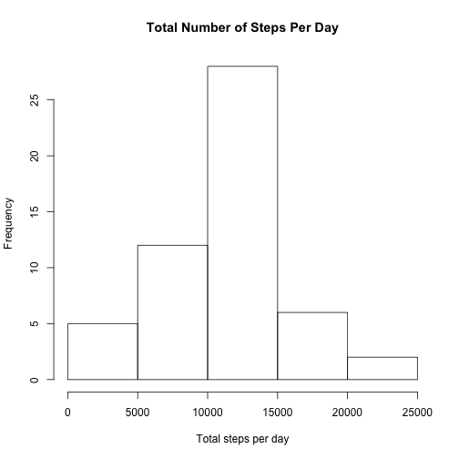
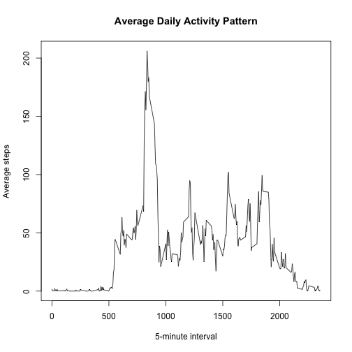
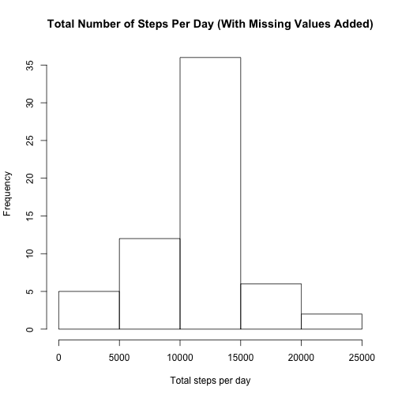
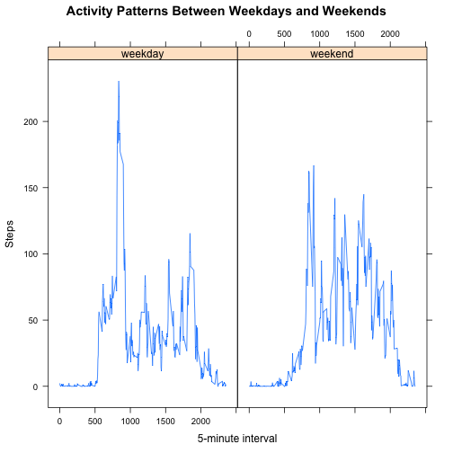

## Loading and preprocessing the data
1. After the GitHub repository for the assignment has been forked and cloned 
into a file called `Reproducible_Research` and the data has been unzipped,
the dataset can be loaded into R with the following code:

```r
setwd("~/Reproducible_Research/RepData_PeerAssessment1")
RepData <- read.csv("activity.csv")
```

2. No preprocessing of the original dataset is necessary at this point, but 
let's load the packages we will need for this assignment.

```r
library(dplyr)
```

```
## 
## Attaching package: 'dplyr'
## 
## The following object is masked from 'package:stats':
## 
##     filter
## 
## The following objects are masked from 'package:base':
## 
##     intersect, setdiff, setequal, union
```

```r
library(lattice)
```

## What is the mean total number of steps taken per day?
For this part of the assignment, we will ignore the missing values, so let's 
create a copy of the dataset that excludes all `NA` values.

```r
ignoreMissing <- na.omit(RepData)
```

1. First, we want to find the total number of steps taken for every date in the 
dataset.

```r
stepsByDay <- summarise(group_by(ignoreMissing, date), sum(steps))
names(stepsByDay) <- c("Date", "Steps")
```

Then, we can plot a histogram of the total steps per day to get a sense of what
the average value will be.

```r
hist(stepsByDay$Steps, main ="Total Number of Steps Per Day", 
     xlab = "Total steps per day")
```

 

2. The mean and median total number of steps taken per day are calculated below.

```r
mean(stepsByDay$Steps)
```

```
## [1] 10766.19
```

```r
median(stepsByDay$Steps)
```

```
## [1] 10765
```

## What is the average daily activity pattern?
To understand the average daily activity pattern, we find the number of
steps taken for each 5-minute time interval, averaged across all days.

```r
intervals <- summarise(group_by(ignoreMissing,interval), mean(steps))
names(intervals) <- c("Interval", "Steps")
```

1. A time series plot, shows the average activity trend throughout the day.

```r
plot(intervals$Interval, intervals$Steps, 
     type = "l",
     main = "Average Daily Activity Pattern",
     xlab = "5-minute interval",
     ylab = "Average steps")
```

 

We can see that there is little to no activity during normal sleeping hours, a
spike of activity in the morning, and a drop off of activity in the evening.

2. The 5-minute interval with the highest average number of steps taken across
all days in the dataset is as follows:

```r
intervals[which.max(intervals$Steps),]
```

```
## Source: local data frame [1 x 2]
## 
##   Interval    Steps
## 1      835 206.1698
```

## Inputing missing values
1. The original dataset has several missing values. The total number of `NA`s 
is:

```r
sum(is.na(RepData))
```

```
## [1] 2304
```

2. The presence of missing days may introduce bias into some calculations or 
summaries of the data. To fill the missing values, we can replace all `NA` 
values with the mean value for the corresponding 5-minute interval calculated
above.

3. The for loop below can be used to fill in the missing values in the original
dataset. The new dataset is called `fullData`.


```r
fullData <- RepData
for (i in 1:length(fullData$steps)){
    if(is.na(fullData$steps[i])){
        fullData$steps[i] <- 
            intervals$Steps[which(intervals$Interval == 
                                      fullData$interval[i])]
        
        }
    }
```

4. We can then group our new dataset by date and find the total number of steps
taken per day, as we did with the original dataset.

```r
fullSteps <- summarise(group_by(fullData, date), sum(steps))
names(fullSteps) <- c("Date", "Steps")
```

By plotting the new dataset, we can see that the general trend of total steps
per day is comparable, but the frequencies are higher after filling in the 
missing values.

```r
hist(fullSteps$Steps, 
     main ="Total Number of Steps Per Day (With Missing Values Added)", 
     xlab = "Total steps per day")
```

 

The mean and median on the new dataset are as follows:

```r
mean(fullSteps$Steps)
```

```
## [1] 10766.19
```

```r
median(fullSteps$Steps)
```

```
## [1] 10766.19
```

As you can see, the mean is the same as it was when we ignored the missing 
values, but the median value has changed from 10765 to 10766.19. This happens 
because we have introduced multiple values of the mean by filling each missing 
value with the means for that 5-minute interval. This essential makes the median 
value meaningless in this case.

## Are there differences in activity patterns between weekdays and weekends?
To answer this question, we first want to create a new dataset from the 
filled-in dataset created above. We also need to convert the date variable into 
the Date class.

```r
newData <- fullData
newData$date <- as.Date(newData$date, "%m/%d/%y")
```

1. Then we can create a new factor variable in the dataset with two levels, 
"weekday" and "weekend", by applying the `weekdays()` function to the date 
variable and determining if that day of the week is on a weekday or weekend.

```r
weekdays <- weekdays(newData$date)
for (i in 1:length(weekdays)){
    if (weekdays[i] == "Monday" | weekdays[i] == "Tuesday" | 
            weekdays[i] == "Wednesday" | weekdays[i] == "Thursday" | 
            weekdays[i] == "Friday"){
        weekdays[i] <- "weekday"
    } else if (weekdays[i] == "Saturday"| weekdays[i] == "Sunday"){
        weekdays[i] <- "weekend"
    } else {
        weekdays[i] <- NA
    }   
}
newData <- cbind(newData, weekdays)
```

2. Using the new weekday factor, we can find the steps for each 5-minute time 
interval, averaged over both weekdays and weekends.

```r
newData <- group_by(newData, weekdays, interval)
newIntervals <- summarise(newData, mean(steps))
names(newIntervals) <- c("Weekday", "Interval", "Steps")
```

The time series plot below allows us to compare the activity trends for weekdays 
and weekends.

```r
plot <- xyplot(Steps~Interval|Weekday, 
               data = newIntervals, 
               type = "l",
               main = "Activity Patterns Between Weekdays and Weekends",
               xlab = "5-minute interval")
print(plot)
```

 

It is evident that there are differences between the average 
weekday and weekend activity. There is a clear spike of activity in the morning 
on weekdays and small spike after normal working hours. On weekends, the 
activity is much more even, with a smaller spike in the morning.
